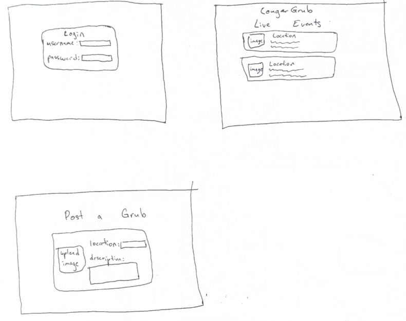
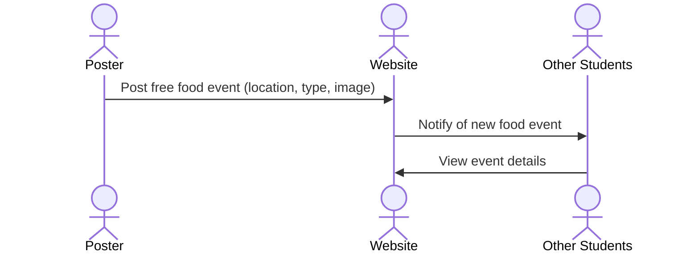

# CougarGrub

[My Notes](notes.md)

CougarGrub is meant to be a web application that is optimized for mobile usage that allows users (BYU students) to upload details of free food (location, type of food, etc.) to the website where other users will be notified.

> [!NOTE]
> If you are not familiar with Markdown then you should review the [documentation](https://docs.github.com/en/get-started/writing-on-github/getting-started-with-writing-and-formatting-on-github/basic-writing-and-formatting-syntax) before continuing.

### Elevator pitch

Food is a basic necessity for human life, and as a college student, it can be quite scarce. Fortunately, BYU's campus can be a treasure trove of free food opportunities. Unfortunately, any student's ability to take advantage of these opportunities is limited to mere chance. CougarGrub enables students not only to captilize on these opportunities, but share with others. Ultimately we don't just want full stomachs, but united communities.

### Design

```mermaid
sequenceDiagram
    actor Poster
    actor Website
    actor Other Students
    Poster->>Website: Post free food event (location, type, image)
    Website->>Other Students: Notify of new food event
    Other Students->>Website: View event details
```

### Key features

- secure login features
- location and image tagging for new free food events
- live updates for new food events

### Technologies

I am going to use the required technologies in the following ways.

- **HTML** - Provides the structural pages of the site: the feed of active food postings, a form for submitting a new food event (location, food type, image), and user profile/login pages.
- **CSS** - Styles the mobile-first layout so the feed of food postings, event cards, and forms look clean and usable on a phone screen 
- **React** - Builds the interactive front end as components with routing between pages like Home, Post Event, and Profile, and reactive state so the feed updates without a full page reload.
- **Service** -  A backend exposes endpoints for creating/fetching food postings, handling login/registration, and calling a third-party API (Google Maps API: https://mapsplatform.google.com/lp/maps-apis/)
- **DB/Login** - stores user accounts and food event data, and supports authenticated endpoints so only logged-in students can post and view
- **WebSocket** - makes live updates possible so a page refresh isn't required every time a new posting is submitted

## 🚀 Specification Deliverable

> [!NOTE]
> Fill in this sections as the submission artifact for this deliverable. You can refer to this [example](https://github.com/webprogramming260/startup-example/blob/main/README.md) for inspiration.

For this deliverable I did the following. I checked the box `[x]` and added a description for things I completed.

- [x] I completed the prerequisites for this deliverable (Git commit requirement)
- [x] Proper use of Markdown
- [x] A concise and compelling elevator pitch
- [x] Description of key features
- [x] Description of how you will use each technology including your 3rd party API and use of WebSocket
- [x] One or more rough sketches of your application. Images must be embedded in this file using Markdown image references.

## 🚀 AWS deliverable

For this deliverable I did the following. I checked the box `[x]` and added a description for things I completed.

- [x] **Rented EC2 server** - I set up an AWS account and was able to follow the instructions to set up an EC2 instance.
- [x] **Leased domain name** - Using route 53 I was able to register a domain name using a .click
- [x] **Server accessible** from my domain: [https://cougargrub.click](https://cougargrub.click) - By adding some records to the DNS dashboard on AWS and editing the caddy file I was able to have my domain name route to my server.

## 🚀 HTML deliverable

For this deliverable I did the following. I checked the box `[x]` and added a description for things I completed.

- [x] I completed the prerequisites for this deliverable (Simon deployed, GitHub link, Git commits) - Got simon deployed using the built in deploy file, transferred the simon folder into this project directory but put it in the gitignore so it doesn't go to the repo.
- [x] **HTML pages** - Created four rough-draft pages (index.html, home.html, currentListings.html, postEvent.html) covering login, dashboard, browsing events, and posting a new event.
- [x] **Proper HTML element usage** - Each page uses semantic elements including header, nav, main, section, article, and footer to structure the content.
- [x] **Links** - Every page has a shared nav bar linking to all four pages, plus in-page links like "See all current listings."
- [x] **Text** - Each page has headings and descriptive paragraph text explaining the app and guiding the user (e.g. the elevator pitch on index.html, instructions on postEvent.html).
- [x] **3rd party API placeholder** - Added Google Maps placeholder divs on currentListings.html (per-event map) and postEvent.html (location picker) for the Maps API I'll integrate later.
- [x] **Images** - Used real photos (BYU Cougars logo, campus, Wilkinson Center, and food photos) pulled from Wikimedia Commons instead of placeholder graphics.
- [x] **Login placeholder** - index.html has login and registration forms, plus a "currently logged in as" placeholder for the authenticated username
- [x] **DB data placeholder** -  currentListings.html renders a list of food event records (title, image, poster, location, timestamp) representing data that will come from the database
- [x] **WebSocket placeholder** - currentListings.html has a "Live Activity" feed showing real-time placeholders for events being created/ended by other users.

## 🚀 CSS deliverable

For this deliverable I did the following. I checked the box `[x]` and added a description for things I completed.

- [x] I completed the prerequisites for this deliverable (Simon deployed, GitHub link, Git commits)
- [x] **Visually appealing colors and layout. No overflowing elements.** - All four pages share a navy, blue, yellow and light-grey palette, with a consistent header, pill nav bar, card sections and footer. Images use max-width/object-fit, and horizontal overflow is prevented so nothing spills off the page at any width.
- [x] **Use of a CSS framework** - I used Bootstrap 5.3 from a CDN for the nav, form controls and buttons, and a Bootstrap carousel on the home page rotates the food tip and a campus photo.
- [x] **All visual elements styled using CSS** - Every page has its own stylesheet covering colors, spacing, borders, shadows and hover effects. The quick-action SVG icons also get their stroke and fill from CSS instead of HTML attributes
- [x] **Responsive to window resizing using flexbox and/or grid display** - Grid handles the page layouts, like the side-by-side login forms, the auto-fitting listing cards and the two-column post page, and collapses them to one column on small screens. Flexbox handles the header, footer, forms and quick-action tiles.
- [x] **Use of a imported font** - I imported Poppins from Google Fonts and used it across the whole site
- [x] **Use of different types of selectors including element, class, ID, and pseudo selectors** - The stylesheets use element (body, h2, main), class (.card-panel, .site-nav), ID (#welcome, #tip-carousel) and pseudo selectors (:hover, :focus, :last-child, ::before, ::after, ::placeholder, ::file-selector-button).

## 🚀 React part 1: Routing deliverable

For this deliverable I did the following. I checked the box `[x]` and added a description for things I completed.

- [ ] I completed the prerequisites for this deliverable (Simon deployed, GitHub link, Git commits)
- [ ] **Bundled using Vite** - I did not complete this part of the deliverable.
- [ ] **Components** - I did not complete this part of the deliverable.
- [ ] **Router** - I did not complete this part of the deliverable.

## 🚀 React part 2: Reactivity deliverable

For this deliverable I did the following. I checked the box `[x]` and added a description for things I completed.

- [ ] I completed the prerequisites for this deliverable (Simon deployed, GitHub link, Git commits)
- [ ] **All functionality implemented or mocked out** - I did not complete this part of the deliverable.
- [ ] **Hooks** - I did not complete this part of the deliverable.

## 🚀 Service deliverable

For this deliverable I did the following. I checked the box `[x]` and added a description for things I completed.

- [ ] I completed the prerequisites for this deliverable (Simon deployed, GitHub link, Git commits)
- [ ] **Node.js/Express HTTP service** - I did not complete this part of the deliverable.
- [ ] **Static middleware for frontend** - I did not complete this part of the deliverable.
- [ ] **Calls to third party endpoints** - I did not complete this part of the deliverable.
- [ ] **Backend service endpoints** - I did not complete this part of the deliverable.
- [ ] **Frontend calls service endpoints** - I did not complete this part of the deliverable.
- [ ] **Supports registration, login, logout, and restricted endpoint** - I did not complete this part of the deliverable.
- [ ] **Uses BCrypt to hash passwords** - I did not complete this part of the deliverable.

## 🚀 DB deliverable

For this deliverable I did the following. I checked the box `[x]` and added a description for things I completed.

- [ ] I completed the prerequisites for this deliverable (Simon deployed, GitHub link, Git commits)
- [ ] **Stores data in MongoDB** - I did not complete this part of the deliverable.
- [ ] **Stores credentials in MongoDB** - I did not complete this part of the deliverable.

## 🚀 WebSocket deliverable

For this deliverable I did the following. I checked the box `[x]` and added a description for things I completed.

- [ ] I completed the prerequisites for this deliverable (Simon deployed, GitHub link, Git commits)
- [ ] **Backend listens for WebSocket connection** - I did not complete this part of the deliverable.
- [ ] **Frontend makes WebSocket connection** - I did not complete this part of the deliverable.
- [ ] **Data sent over WebSocket connection** - I did not complete this part of the deliverable.
- [ ] **WebSocket data displayed** - I did not complete this part of the deliverable.
- [ ] **Application is fully functional** - I did not complete this part of the deliverable.
